# CaseBuilderLib
Design 3D printed cases for random things!

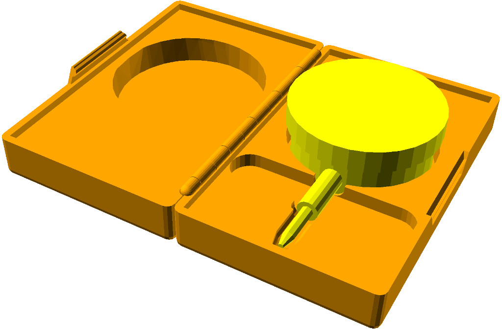 

## How to use this library:

1. **Preparation**
   1. Make a copy of the CaseBuilderLib project template 
      (**CaseBuilderTemplate.scad**).
      The temmplate is intended to be used with the OpenSCAD
      configurator. 

      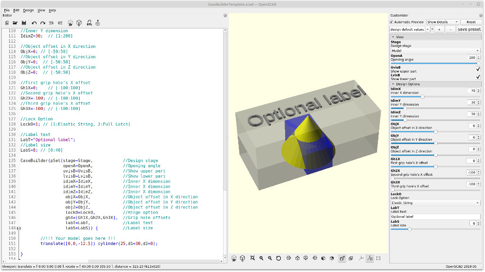 

      The design of a customized case is done in three stages.
      Start by setting the **`Stage`** variable to **"Model"** 
      (value = 1). 

      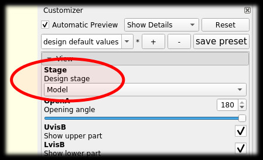

2. **Model Stage**
   1. Design a model the parts of your case content as children
      of the **`CaseBuilder()`** module. 
      Construct each part of the content using primitive shapes. 
      Complex shapes will be wrapped in a hull.
      Use exact measures. 
      Slack will be added to the cavities automatically.

      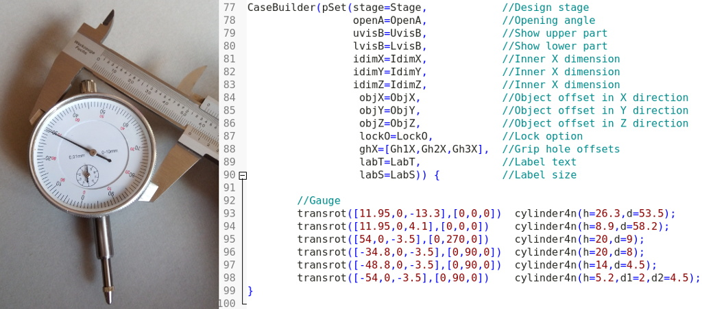 

   2. Configure the inner dimansions of the case by setting the
      **`IdimX`**, **`IdimY`**, and **`IdimZ`** variables.
      If necessary, adjust the position of the content through the
      **`ObjX`**, **`ObjY`**, and **`ObjZ`** variables.

      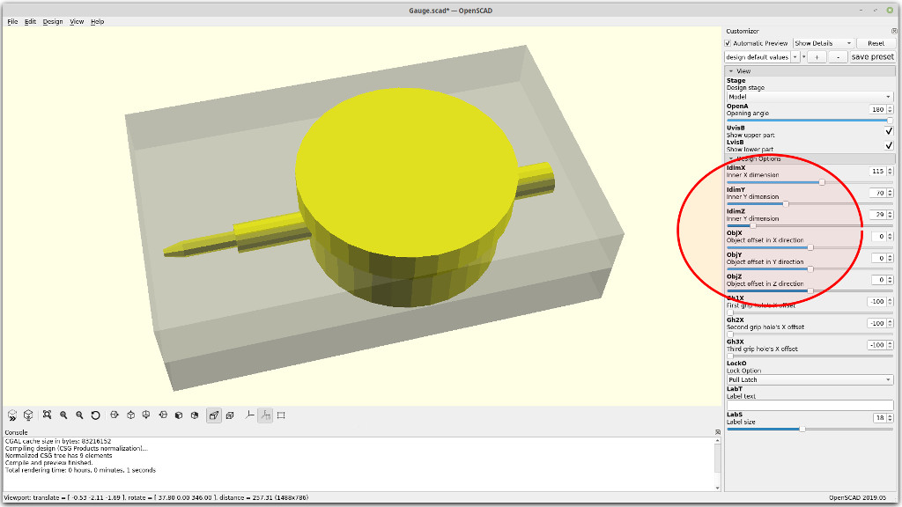 

  3. If needed, add some grip holes by setting the variables
      **`Gh1X`**, **`Gh2X`**, or **`Gh3X`** to a value within the inner 
      X dimension.
      Further grip holes can be added by manually extending the
      **`ghX`** array within the instantiation of the 
      **`CaseBuilder()`** module.

      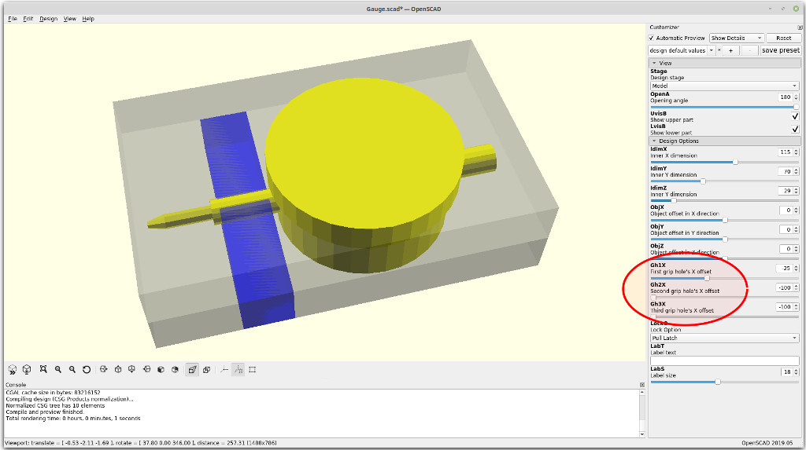 

   4. Select a lock option through the **`LockO`** variable.
      Options Are:
      * No lock (**`LockO`** = **0**)
      * Elastic string (**`LockO`** = **1**)
      * Pull Latch  (**`LockO`** = **2**)

      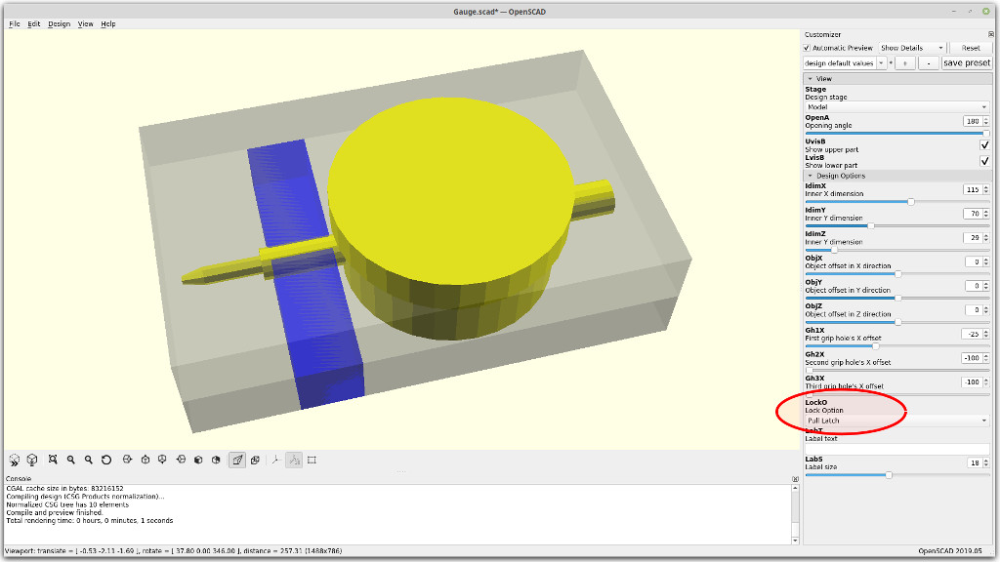 

   5. Add an optional label to the case by setting the string
      variable **`LabT`**. The font size can be adjusted through
      the variable **`LabS`**.

      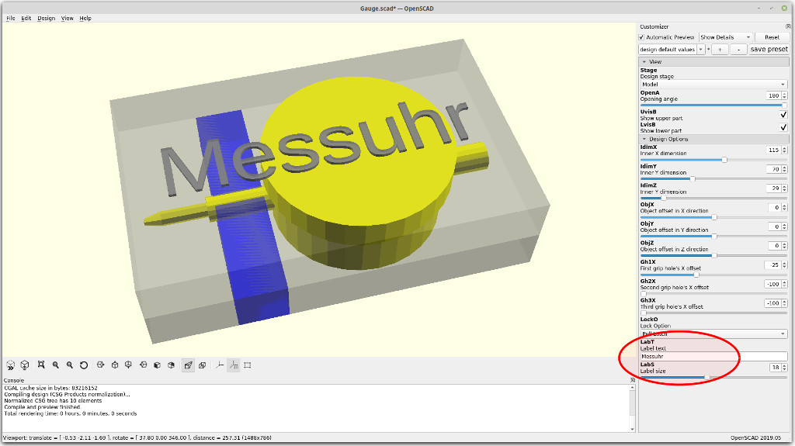 

      Continue by setting the **`Stage`** variable to **"Check"** 
      (value = 2). 

      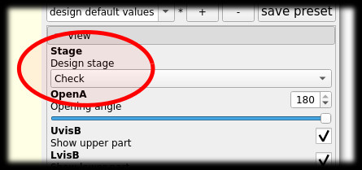 

3. **Check Stage**
   1. Review the design. 
      Make sure to resolve all problems highlighted in red.
      The case can be opened or closed by adjusing the angle in
      the **openA** variable.  
      The upper part of the case can be eclipsed through the 
      **UvisB** variable.
      The lower part of the case can be eclipsed through the 
      **LvisB** variable.

      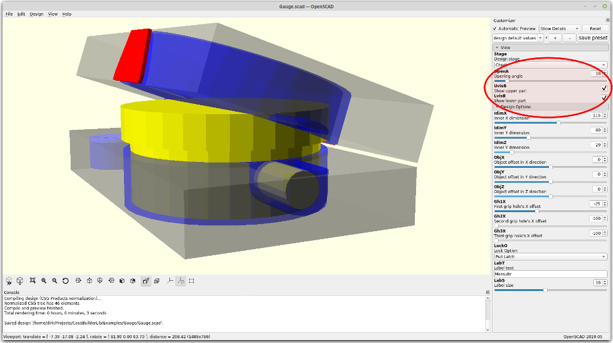 

       Continue by setting the **Stage** variable to **"Generate"** 
      (value = 3). 
      
      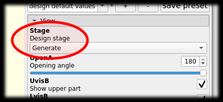 

4. **Generate stage**
   1. Do a final review of the design.
      Use the **OpenA**, **UvisB**, and **LvisB** variables for a
      detailed inspection.

      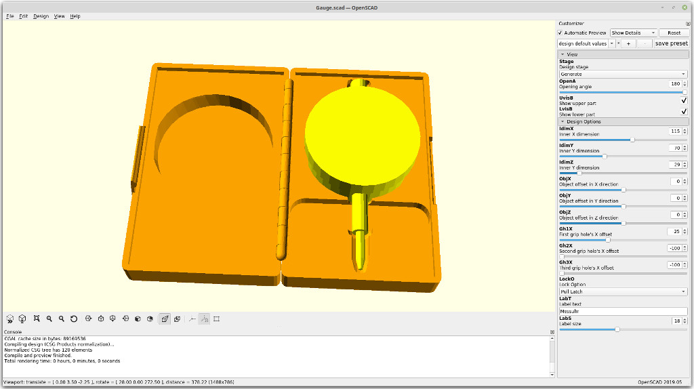 

  2. Render the design and generate a [STL file](https://github.com/hotwolf/CaseBuilderLib/blob/master/Examples/Gauge/Gauge.stl).

      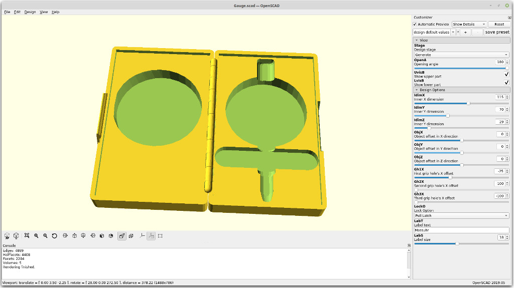 

   3. Slice and print.

      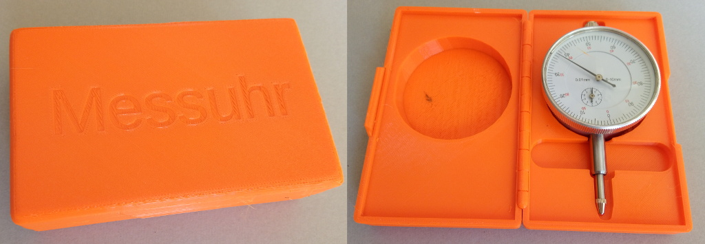

